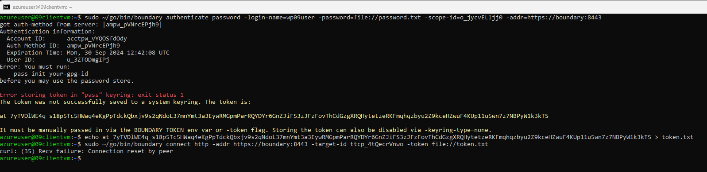
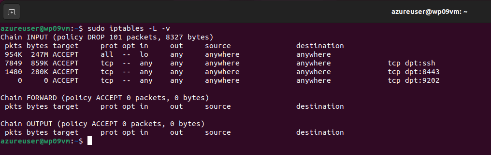
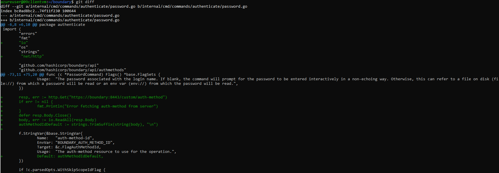

# Hardened Boundary Server

## Task 1: Image Hardening

The goal of this task was to create a hardened Ubuntu 22.04 Image using Packer.
Additionally, the provisioning agent was to be removed from the VM after the first boot.

- [Packer config](./docs/packerconfig.pkr.hcl)
- [OSCAP report before hardening](./reports/reportbefore.pdf)
- [OSCAP report after hardening](./reports/reportafter.pdf)
- [Deployment screenshots](./docs/ImageDeployment.pdf)

## Task 2: Boundary Installation

The scope of this task was to set up a boundary installation on the hardened VM, also deploying a web server and remote proxy.
Additionally, firewall rules were to be configured. A boundary user was to be created with access to a single target.

On the client side, the boundary source code was to be adapted so the user would not have to provide an Auth Method ID.

- Client connection
    - The following picture shows how the authentication gets established. 
    - However, we encountered an issue with curl which we could not resolve in time.
     
- Iptables
    - The following picture shows the netfilter configuration of the VM hosting boundary which allows access only to the public services and SSH.
      
- Source code
    - The boundary source code was modified on a client machine to statically fetch the Auth Method Id from the server
    - The following picture shows the changes made to the `password.go` file
     
