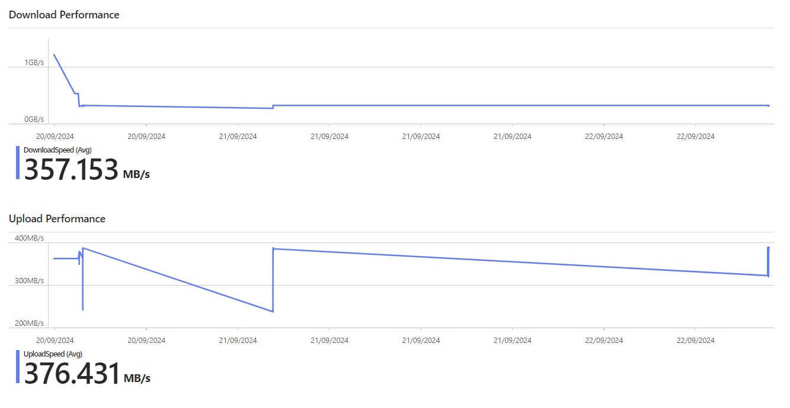

# Use Azure file shares in a multi region environment

## 1. Objective

Setup two Azure region (for example EU, US) connected to each other using VNET peering. The EU configuration will host a file share providing upload and download capabilities, serving single and parallel downloads from multiple clients. 

Optimize for best performance and provide proof with measurements. Additionally, create a secure and authenticated/authorized connection concept from a US office to the web service hosted in the EU. IaC is managed by Terraform.

### Key Components
- US-West Office Resource Group: `uswest1`
- EU Central Office Resource Group: `eucentral`
- Virtual Network Peering: Secures private network connectivity between two regions
- Authentication & Authorization: Ensures only authorized users and systems access the resources
- Encryption: Data is encrypted both in transit and at rest

## 2. Architecture

This architecture is utilizing Azure File Share.
We decided to go for an Azure File Share (Ref [Here](https://learn.microsoft.com/en-us/azure/storage/files/windows-server-to-azure-files))

 - Reduce TCO with fully managed file shares
 - Broad compatibility with Windows file servers
 - Flexible deployment and hybrid access
 - Simplified data protection and access control

This design offers a secure and authenticated solution to connect resources between the US office and the EU web service using Azure VNet peering. It incorporates robust security practices, such as identity management, encrypted communication, and comprehensive monitoring. These measures ensure that data is protected in transit and at rest, and that only authorized users can access services.

We have used authentication over SMB for accessing Azure file shares. This setup provides the same seamless single sign-on (SSO) experience when accessing Azure file shares as accessing on-premises file shares. Your client needs to be domain joined to AD DS, because the authentication is still done by the AD DS domain controller. Also, you need to assign both share level and file/directory level permissions to get access to the data. Share level permission assignment goes through Azure RBAC model. File/directory level permission is managed as Windows ACLs. 

Data file transfer communication would go through vnet -> vnet using via Storage Account Private EndPoint through DNS.

## 3. Network Design Overview

### Network Architecture

The following components will be deployed in two regions:
1. **US-West Office** (Resource Group: `uswest1`)
   - Virtual Network (VNet): `vnet-uswest`
   - Subnets: Defined to handle office resources
   - Network Security Groups (NSGs): Control traffic flow
   - Private End Point
   - Private DNS Zone to resolve private endpoint

2. **EU Central Office** (Resource Group: `eucentral`)

   - Virtual Network (VNet): `vnet-eucentral`
   - Subnets: Defined for web services and secure communication
   - Network Security Groups (NSGs): Control access to the web services

## 4. VNet Peering Setup

### VNet Peering Design

- **Objective**: Securely connect the `vnet-uswest` and `vnet-eucentral` networks using **VNet Peering** to create a private, secure communication path between both offices without exposing resources to the public internet.
- **Solution**: Traffic between these VNets will stay within the Azure backbone, reducing latency and enhancing security.

Note: Architectural diagram is showing the VNET peering.

### **Step 1: Create Virtual Networks in US and EU Regions**

- US-West VNet
- EU-Central VNet

### Step 2: Enable VNet Peering

- From US-West to EU-Central
- From EU-Central to US-West

### Step 3: Configure Network Security Groups (NSGs)

Apply appropriate NSG rules to allow traffic between the two VNets for specific ports/services (e.g., HTTPS).

## 5. Authentication and Authorization Mechanisms
### Authentication Mechanisms

1. **Azure Active Directory (AAD)**: Use AAD for managing identities and implementing access control for users and applications.
   - **Service Authentication**
   - **User Authentication**

### Authorization Mechanisms

1. **Role-Based Access Control (RBAC)**: Control which users or applications can access resources by assigning Azure roles (e.g., Reader, Contributor) in both resource groups (`uswest1` and `eucentral`).
2. **NSG Rules**: NSGs ensure that only traffic from trusted subnets or users is allowed to pass through the network.

## 6. Data Encryption

### Encryption in Transit

All data flowing between the US and EU VNets will be encrypted using **TLS/SSL** protocols. The connection through VNet Peering remains private over the Azure backbone and does not traverse through the public internet.

### Encryption at Rest
All data stored in Azure will use Azure-managed encryption at rest, leveraging **Azure Storage Service Encryption (SSE)** and **Azure Disk Encryption** for VMs. By default, data stored in Azure Files is encrypted with Microsoft-managed keys. With Microsoft-managed keys, Microsoft maintains the keys to encrypt/decrypt the data and manages rotating them regularly. You can also choose to manage your own keys, which gives you control over the rotation process.

## 7. Performance Dashboard

File upload and download speed can be measured recorded in Azure Log Analytics and can be monitored using custom reports.
This dashboard can be configured for more reports based on specific needs including usages of file share quota.

## 8. Security Concepts

[Please read more about Security Concepts here](./Security.md)

## 9. Scalability

Azure file share size is limited to 100 tebibytes (TiB). There's no minimum file share size and no limit on the number of Azure file shares.
Maximum size of a file in a file share is 1 TiB, and there's no limit on the number of files in a file share.
IOPS and throughput limits are per Azure storage account and are shared between Azure file shares in the same storage account.